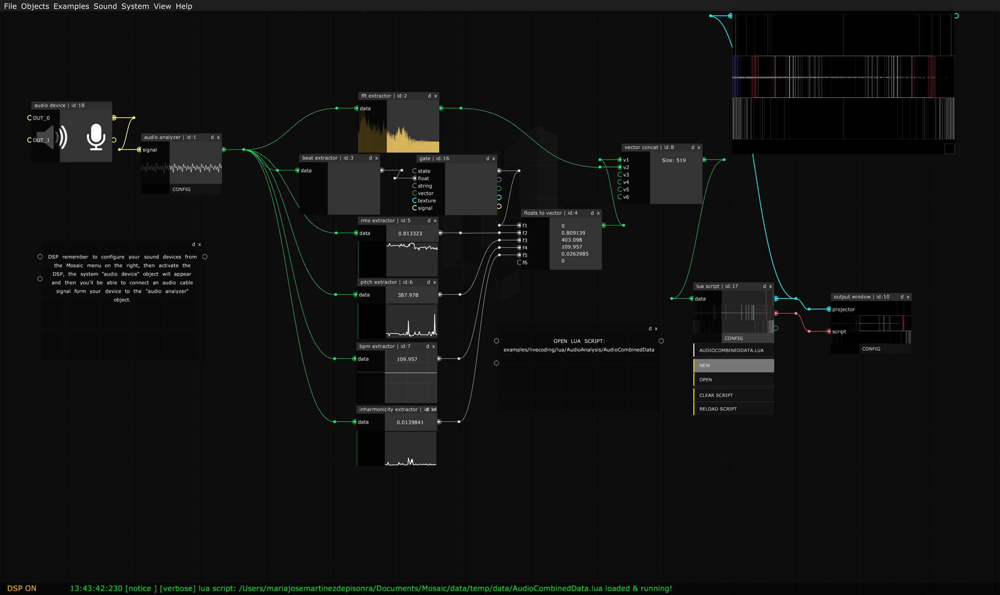

# Quick Start

[Mosaic](https://mosaic.d3cod3.org/) is a visual and live coding environment, based on [openFrameworks](https://openframeworks.cc/) 0.10.0, is open-source and, although it is multiplatform (OSX, Linux and Windows) it is more logical that open source applications are used in open source operating systems, so there are specific installation scripts for different Linux distros.

Specifications:

```
- cross-platform (until Apple and Microsoft decides to drop support for openGL, then it will be Linux only)
- multi-threaded
- non-blocking system dialogs
- internal code editor
- lua/python/processing/glsl/bash live-coding
- pure data live-patching
- non-linear interactive timeline
- warping integrated on output window object
- map-map style integrated mapping module
```

------

Once Mosaic is installed and launched (see [installation](Installing.html))  you will see the toolbar menu and the canvas, where the objects will be placed.




To add an object, right-click on the canvas and the object menu will appear, ordered by category. If you select an object, it will be placed on the canvas. From the top menu **Objects** you can select it as well.  

You can move the objects by dragging them with the mouse to wherever you want. With the mouse scroll you can zoom in or out of the canvas.

Most objects have connectors, on the left side are inlets and on the right side are outlets. By dragging the mouse from the outlets we'll see how a cable is stretched, and next to it we'll see the type of data it transmits and the name of the outlet. When you bring the cable close to the inlet of another object, that inlet increases in size if it is the same type of data that the cable transmits, if it is another type of data it cannot be connected.

There are six cables types  to communicate six data types  between objects. Each of the cables, as well as the inlets and outlets are identified by their color according to the type of data:

| **Connection type** | **Variable** | **Color** |
| ----------------- | ----------------- | --------- |
| Numeric         | float             | **<span style="color:rgb(210,210,210)">Grey</span>**  |
| Text		        | string            | **<span style="color:rgb(200,180,255)">Violet</span>** |
| Array             | vector<float\>    | **<span style="color:rgb(120,255,120)">Green</span>** |
| Texture                             | ofTexture                          | **<span style="color:rgb(120,255,255)">Blue</span>**              |
| Pixels                             | ofPixels                          | **<span style="color:rgb(0,180,140)">Emerald Green</span>**              |
| Sound                              | ofSoundBuffer                 | **<span style="color:rgb(255,255,120)">Yellow</span>**    |
| Live Coding                       | Mouse/Keyboard Interaction        | **<span style="color:rgb(255,128,128)">Red</span>**               |

[](https://vimeo.com/394048806)
