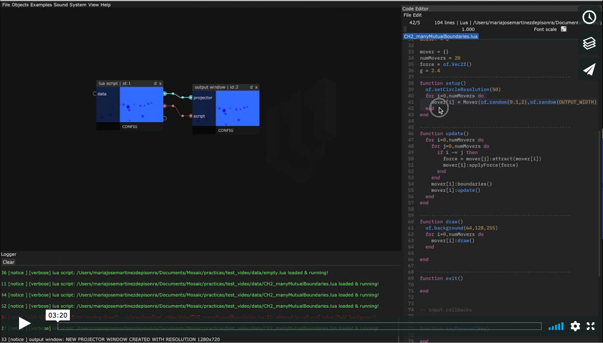

# Menú

La interface de Mosaic tiene un menú superior con las opciones **File**, **Objects**, **Examples**, **Sound**, **System**, **View** y **Help**.

El menú de **File** permite gestionar los Patch (archivos de Mosaic en formato .xml) con las opciones para generar uno nuevo: **New patch**, abrir uno previamente guardado: **Open patch**, abrir el código xml de un patch en un editor de código: **Open patch source**, o guardar el archivo actual: **Save patch As**. Por último **Quit** cierra Mosaic.

Los patch se guardan solo una vez, y según vayamos trabajando el archivo  se irá guardando automáticamente por lo que al terminar el trabajo no  hay que volver a guardarlo.

En el menú **Objects** están los objetos organizados por tipos:  **audio** **analysis**, **communications,** **computer vision**, **data**, **graphics**, **gui**, **logic**, **math**, **scripting**, **sound**, **video**, **web**, y **windowing**. Este menú de objetos también aparece en cualquier lugar del canvas al clicar el botón derecho del ratón.

En el menú examples, los ejemplos están organizados tipos:

La opción **Livecoding** contiene ejemplos de archivos bash, glsl (shaders), lua, processing y  pyton. Al seleccionar uno de los ejemplos, en el canvas del patch que  tengamos abierto aparece un objeto scripting que le corresponda con el  archivo ya cargado.

La opción **Livepatching** contiene un template que hay que utilizar para que Mosaic se comunique con pure data.

Si seleccionas un ejemplo de la opción **Visual programming**, Mosaic cerrará en patch que tengas abierto y abrirá el del ejemplo seleccionado.

El menú **Sound** permite configurar el sistema de sonido: al desplegar **Input Device**, se selecciona el dispositivo de entrada de audio del ordenador y en **Output Device**, el de salida. Tras ello, es necesario activar **DSP ON** y al hacerlo aparece el objeto **audio device** en el espacio de trabajo, se trata de un objeto de sistema de Mosaic,  lo que significa que no se puede agregar/eliminar como los otros  objetos, y establece una conexión directa con el dispositivo de audio del ordenador que se ha seleccionado.

Si clicamos la opción **DSP OFF** el objeto **Audio Device** no desaparece, pero permanece inactivo, podremos ver que en la barra  inferior de Mosaic DSP OFF en color gris, y  cuando lo activamos señala DSP ON en color naranja.

En el menú System, la primera opción **FPS**, permite seleccionar el número de fotogramas por segundo que queremos para el patch.

**Screenshot** permite guardar una imagen del patch que se esté realizando.

En el menú View, si se activa **Code Editor**, se abre en la parte derecha de Mosaic un editor de código para programar los archivos vinculados a los objetos de scripting.

Si se selecciona **Profilier** ([perfilador](https://es.wikipedia.org/wiki/Análisis_de_rendimiento_de_software)) se mostrará en la parte inferior derecha una tabla que señala los  tiempos que tarda el sistema para ejecutar cada uno de los objetos  incorporados, esto nos permite saber en tiempo real si se está usando o configurando algún objeto de manera equivocada, cuando el tiempo de  procesamiento es elevado, es decir, permite detectar los puntos  problemáticos del patch. Una vez analizados los resultados es  conveniente desactivarlo para reducir el consumo.

Al activar **Logger** se abre en la parte inferior la  consola de salida del Mosaic. Esta consola informa de las características de los dispositivos conectados y también señala  en rojo los problemas, por ejemplo, si al trabajar con archivos de scripting existe algún error, indica el número de línea donde se  encuentra el problema.

A través de las opciones del menú Help se puede acceder a la página web de Mosaic en Github, a la página Reference en la web de Mosaic -en la que se describen los objetos-, a la página de documentación de openFrameworks, o a la de los Addons oficiales de openFrameworks.

